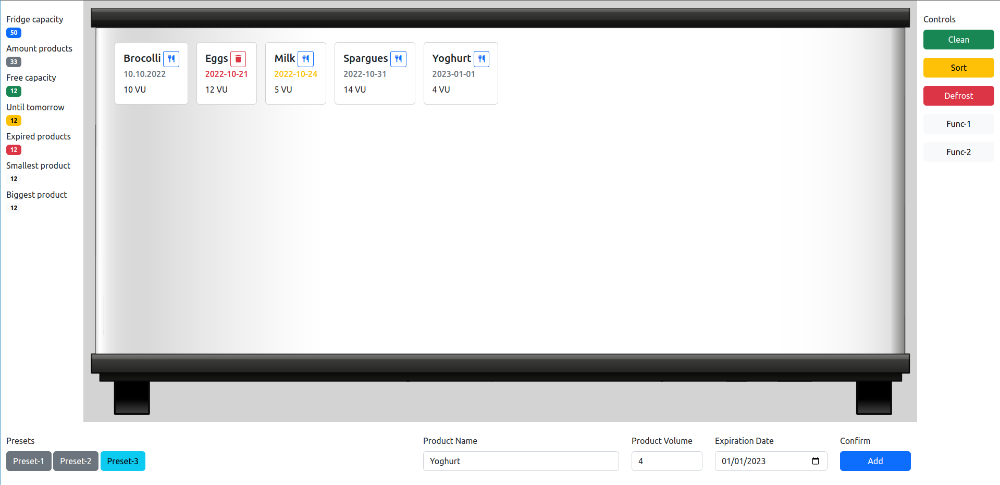

# PB Graduation Project: Fridge Management App

## Introduction
This is the final project for the Programming Basics module.
It contains a few additional folders besides this README that describes the task.

### Default file structure
- `src/` -> This folder contains all code of the project. This includes
     - `index.html` -> The HTML file that contains all the markup of the GUI.
     - `css/` -> This folder contains all the necessary CSS for the GUI.
     - `img/` -> This folder contains all the image files required for the GUI.
     - `js/` -> The folder for all javascript files:
         - `main.js` -> The main javascript file which already contains some helpful code and should contain for handling all user interactions on the GUI.
         - `fridge.js` -> An extra file for the fridge class needed for the data structure.
         - `product.js` -> An extra file for the required product class, which is required for the data structure.
- `docs/` -> This folder serves as a storage location for all necessary documentation files.
- `.gitignore` -> This file is evaluated by `git`. `git` ignores all files and folders in it.

Keep this file structure as clean as possible. If you need additional files, put them in a suitable folder if possible.
If you have files or folders that you need in your local copy of the project but don't want to include in the repository, add them to the `.gitignore` file so that `git` will ignore them.

## Project description
The following image shows a screenshot of the GUI for the fridge management app.

### Scenario
A web app for managing a refrigerator is being developed as part of a larger project.  
The GUI design team has already designed a GUI based on the project specification, as shown in the figure above.

As an experienced Javascript frontend developer, you should now fill the GUI with life, creating the necessary data structure and connecting the GUI elements with functions for manipulating this data structure.  
You now have almost a week to do this, so get to work ;-)

### Specifications
#### **The GUI**
The user interface was created with Bootstrap and can be divided into **four** rough parts:
- In the **left column** is the info area. This shows some key figures of the managed refrigerator. This includes the total refrigerator capacity, the number of products stored in the refrigerator, the remaining capacity, the number of products that will expire the next day, the number of expired products, the volume of the smallest product and the volume of the largest product.
Each of the badges for the corresponding number was stored with an ID in the markup so that they can be conveniently addressed from Javascript.
- The **right column** serves as the fridge control panel. It contains buttons for performing various functions of the refrigerator. These include:
     - Clean -> This function is intended to remove all expired products from the refrigerator.
     - Sort -> This function sorts the contents of the refrigerator in ascending order according to the expiry date of the products.
     - Defrost -> This function removes all products from the refrigerator.
     - Func-1 -> This button is freely programmable for additional functionality.
     - Func-2 -> This button is freely programmable for additional functionality.

- The **middle column** shows the refrigerator with the stored products. The products are stored there as tiles with the most important information and a delete button.

- The **lower area** consists of an add mask for new products to be stored as well as a preset area where presettings for the input mask can be stored on the buttons.

#### **The data structure**
A class-based data structure is to be created for the internal mapping of the data.  

To map the **fridge** the class `Fridge` from `src/js/fridge.js` should be used.  
The class should accept a `capacity` as an integer in the constructor and assign this to the instance.  
In addition, the class needs a data field to store the products contained in the refrigerator.
An array would be the first choice for this.

The `Product` class from `src/js/product.js` should be used to map the individual stored **products**.  
The class should receive the following data via the constructor and assign it to the instance:
- The name of the product as a string
- The volume of the product as an integer
- The expiry date of the product as a date

For simplification, the imaginary unit `VU` is used as the unit for the volume.

When creating new products, a new instance of the `Product` class should be created and, if there is still enough free space in the refrigerator, it should be saved with the array in the instance of the `Fridge` class.

#### **Required Functionality**
For the management of the products in the refrigerator, some functions are expected:
- Adding new products using the form at the **bottom of the GUI**.
- Removing individual products that have already been stored using the delete button on the **product tiles in the middle column**.
- Removing all already expired products using the `Clean` button in the **right column** of the GUI.
- Sorting all products by expiry date in ascending order (ie oldest date first) using the `Sort` button in **the right column** of the GUI.
- Removing ALL stored products using the `Defrost` button in the **right column** of the GUI.

**BONUS**: You may want to have some presets for adding products that enter predefined values for `Name` and `Volume` into the mask at the push of a button, so that only an expiry date needs to be added manually.

Some display values **in the left column** of the GUI are provided for monitoring the status of the refrigerator:
- The total capacity of the refrigerator, i.e. the total volume stored in the refrigerator instance (`Fridge capacity`).
- The number of products already stored (`Amount products`).
- The free capacity of the refrigerator, i.e. how much volume is still available in the refrigerator (`Free capacity`).
- The number of products that expire in one day (`Until tomorrow`).
- The number of products that have already expired (`Expired Products`).
- The volume of the smallest product, i.e. the product with the smallest volume (`Smallest product`).
- The volume of the largest product, i.e. the product with the largest volume (`Biggest product`).

Don't forget that if the data changes, these ads should also be updated.

### Method
1. After reading through this project description, first familiarize yourself with the GUI by starting the project and looking at it in the browser.
The buttons will of course have no function at first, because this is your job ;-) 
This step gives you an overview of the app and the range of functions.

2. Once you understand the GUI this far, you should look at and familiarize yourself with the project and code structure in the code editor. 
The project consists of several files, so it is important to keep track of which file serves which purpose.
     > Order is half the life.

     Just as this sentence often fits everyday life, this principle also applies to coding.
     So try to structure your code cleanly and clearly right from the start, and to write meaningful comments (yes, these are also part of the assessment of the submission).

3. If you now want to start coding, it is advisable to take care of the data structure first, i.e. the classes `Fridge` and `Product`. 
Complete the provided classes and test them extensively in the browser console.
Only when the data structure is correct and the associated methods work reliably can you worry about connecting to the GUI and know that possible errors are not in the data, which makes it much easier to fix them.

4. As soon as you start the GUI, I recommend that you already store some products in your `Fridge` instance with which you can test well. 
First and foremost, take care of displaying the data (status numbers in the left column and product tiles in the middle area). The best thing would be to write a function that renders all variable data into the GUI in one go, so that you can call it up without hesitation after each data manipulation and it will re-render the entire display for you. 
This is bound to be quite a large function, feel free to break it down into a few small helper functions. 
The `src/js/main.js` already contains a helpful function `createNewProductCard`, which creates a product tile based on the transferred data and returns it as a return value. Use this, because it saves you a lot of effort.

5. When you're done with the general render function, you could move on to the Add Mask functionality. To do this, get the necessary references to the data fields and the confirmation button and attach an `EventListener` to the latter, in which you validate the data entered by the user (i.e. check for completeness and correctness) and create a new `Product` instance from it. Of course, this may only be saved in the `Fridge` instance if the fridge still has enough free volume.

6. When you're confident through extensive testing that adding new products works well, move on to removing individual products.
The `createNewProductCard` function takes a `deleteCallback` as a parameter, which is called when the delete button is clicked. 
So go back to the piece of code that renders your product tiles and give the function a callback to clear it.

7. After adding and deleting works well, you can go to the **right column** of the GUI and give the respective buttons the functionality described before. 
**Again applies here:** _First of all, manipulate the data and then let the GUI render the data set. This approach saves you the hassle of adding, editing, and removing individual GUI elements._

8. The task leaves a lot of room for extensions. If you are done with everything and still have time for extensions such as the presets, you are welcome to work on them.
However, all of this is BONUS and should only be worked on when the basic functionality is already working correctly.  
Of course, if you need some inspiration or advice, feel free to contact the teacher and assistant teacher.

Take this roadmap as a strong recommendation, but do not necessarily take it as an absolute guide.
Programming is a creative activity, which means that slight deviations from this approach are perfectly normal, as long as it makes your work easier and gets you to your goal.

### Documentation
A small reflection as a Markdown file should also be included with the project.
Describe your approach to development and the following three questions:
- What went particularly well?
- What didn't go so well?
- What would I do differently next time in terms of my approach or working method?

The file should be placed in the `docs/` folder and checked into your project's repository.
### Project presentation
At the end of the project there will be a small presentation of your project.

In the course of the presentation, you should show how your project works and possibly address any special features.

Also, give the audience an insight into the project structure and your code. Happy to explain special solutions.

The presentation should be as if you, the developer, wanted to sell your solution to us, the client. Funny slogans don't have to be, but enthusiasm should be there.
Show us why we should be convinced of your solution.

Slides are not mandatory, but you are welcome to create them. Feel free to be creative and plan your presentation.
Think of good examples beforehand and practice your presentation.

If you have any questions, the teacher and the assistant teacher are of course always available.

I wish you success!